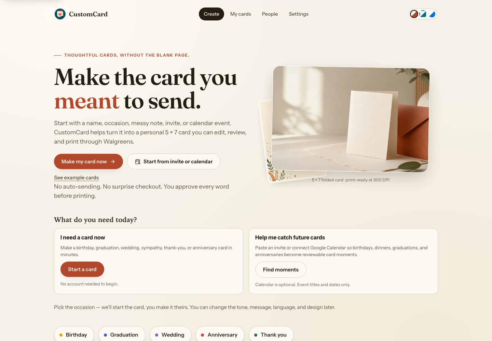
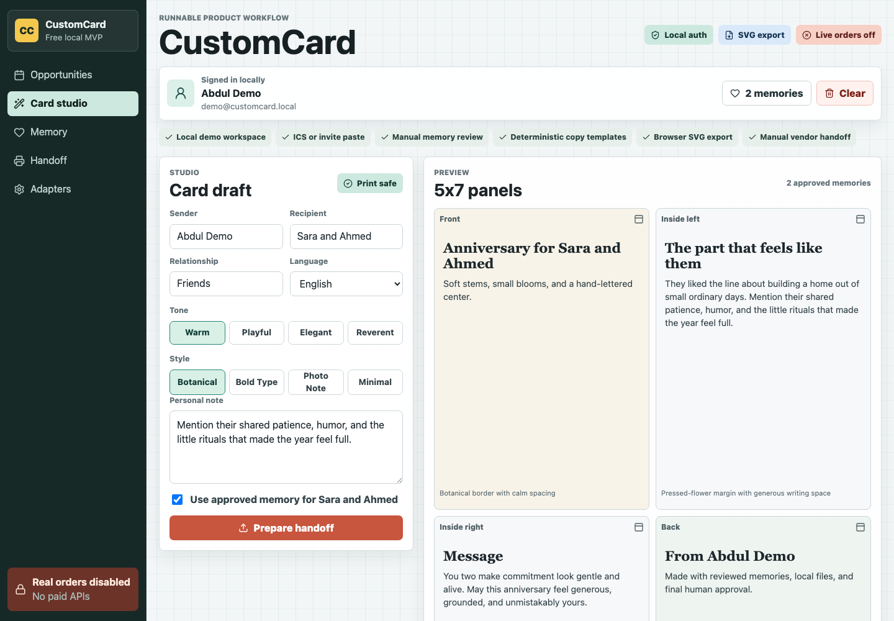
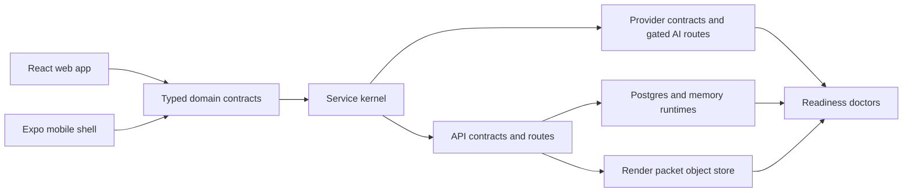

<p align="center">
  
</p>

<h1 align="center">CustomCard</h1>

<p align="center">
  <strong>Relationship-aware greeting cards, from event signal to print-ready handoff.</strong>
</p>

<p align="center">
  CustomCard is a runnable local MVP and production-shaped skeleton for an AI card concierge:
  it spots card-worthy moments, helps compose personal notes, renders 5x7 panels, and prepares a safe retail-print handoff.
</p>

<p align="center">
  <a href="https://github.com/abhidya/CustomCard/actions/workflows/verify.yml"></a>
  
  
  
  
</p>

<p align="center">
  <a href="#quick-start">Quick start</a>
  · <a href="#what-works-today">What works</a>
  · <a href="#architecture">Architecture</a>
  · <a href="#verification">Verification</a>
  · <a href="#project-map">Docs</a>
  · <a href="CONTRIBUTING.md">Contributing</a>
  · <a href="SECURITY.md">Security</a>
</p>



## Why CustomCard

Buying a generic card is fast but impersonal. Writing a great one is meaningful,
but usually happens under time pressure. Retail print shops can produce nice
cards, but users still have to write the message, design the panels, format the
files, and avoid bad checkout surprises.

CustomCard is the product wedge between those worlds:

- Detect the moments where a card is warranted.
- Ask for only the relationship context that improves the card.
- Generate inspectable card copy and visual direction.
- Produce print-safe 5x7 panels and a checksum-backed render packet.
- Recommend pickup or shipping paths without placing a real order before certification.

## What Works Today

| Surface | Current state |
| --- | --- |
| Web app | Vite, React, and TypeScript app with customer, studio, print, mobile-preview, legal, and operations surfaces. |
| Local onboarding | Browser-local workspace auth plus manual invite text, ICS, vCard, and CSV import paths. |
| Card workflow | Opportunity review, relationship memory review, deterministic card draft generation, and 5x7 panel export. |
| Print handoff | Four 1500 x 2100 SVG panels, local PDF proof, checksum manifest, and manual printer checklist. |
| Fulfillment recommendations | Review-only public pricing and pickup/shipping recommendation contracts for retail printers. |
| Admin readiness | Provider catalog, readiness registers, production gates, deployment posture, and doctor scripts. |
| API runtime | Contract, memory, fake-pool Postgres, isolated live Postgres, idempotency, audit, queue, and artifact-store boundaries. |
| Mobile shell | Expo customer app contract, release doctor, and a browser-inspectable mobile route at `/?view=mobile`. |
| Deployment shape | Vercel/serverless route, static API server, Docker Compose, Kubernetes manifests, Postgres migration, worker, and object-store contracts. |

## Intentional Boundaries

The current repo is honest about what it does not prove yet.

| Area | Boundary |
| --- | --- |
| Live auth and OAuth | Credential-gated. Local review uses browser-local workspace state. |
| Live AI/image generation | Same-origin server routes exist; provider/model policy is configured in Admin and falls back to deterministic no-cost generation when credentials are absent. |
| Retail ordering | Disabled by design. The kill switch stays off until vendor certification, payment, refund, and physical print proof exist. |
| Live quotes and coupons | Public observations and same-cart proof contracts are modeled; checkout confirmation is still required. |
| Payments | Readiness contracts exist; live charge, refund, capture, PCI, and settlement proof are not claimed. |
| External audits | Repo-local security, privacy, and accessibility checks exist; external legal/security/privacy/accessibility audits are not claimed. |
| Native releases | Expo source and release contract exist; signed iOS/Android artifacts and emulator screenshot proof are still gated. |

## Quick Start

Prerequisites:

- Node.js 24 or newer. The package engine is `>=24`.
- npm, bundled with Node.

```sh
npm ci
cp .env.example .env.local
npm run dev
```

Open the Vite URL printed by the dev server. The app opens into the free local
workflow and does not require paid AI, payment, retail, CRM, email, or cloud
credentials.

Use `npm install` instead of `npm ci` only when you intentionally need to update
the lockfile.

To open the mobile customer UI in a desktop browser:

```sh
npm run mobile:web:preview
```

That launches the same app at `/?view=mobile`. The Expo dev-server URL is for
native runtime metadata and can render a JSON manifest in desktop browsers; the
Vite mobile route is the browser review path.

## Optional Provider Setup

The tracked `.env.example` uses placeholders only. It includes the public Clerk
publishable-key placeholder, Clerk JWKS public-key verification slots,
legal-policy link slots, server-owned provider credentials, and Google Calendar
OAuth start settings such as `GOOGLE_OAUTH_TOKEN_ENCRYPTION_KEY`.

Full backend/runtime variables live in `infra/env/.env.example`, including
Postgres, queue, object storage, signed artifact URLs, API runtime mode, session
tokens, and provider credentials. Runtime scripts fail closed when required
variables are missing or still use placeholder values.

The legacy Walgreens hosted-checkout backend remains disabled by default and is
not exposed in the current customer app flow. If it is revisited for a certified
sandbox pilot, keep server-only credentials such as `WALGREENS_API_KEY`,
`WALGREENS_AFF_ID`, and `PUBLIC_APP_ORIGIN` in `.env.local`, `infra/env/.env`,
or Vercel environment variables only; vendor mode belongs in admin safety
controls.

Local `.env.local` and `infra/env/.env` files are operator-owned, ignored
secret files. Security scans may report them, but cleanup work must not delete,
move, truncate, or overwrite those files unless the operator explicitly asks for
that exact action in the same turn. Report the finding and recommend rotation or
secret-manager sync instead.

Useful modes:

```sh
# Static/local reviewer mode
CUSTOMCARD_API_RUNTIME=contract npm run api:doctor

# Memory-mode API contract
npm run api:doctor:memory

# Postgres runtime contract
npm run api:doctor:postgres
```

`api:doctor:memory` passes `--local-auth-fallbacks` so static customer/admin
tokens stay limited to local reviewer drills. QA and production should use Clerk
JWT verification with Postgres.

Common local commands:

| Command | Purpose |
| --- | --- |
| `npm run dev` | Start the Vite app on `127.0.0.1`. |
| `npm run preview` | Preview the production build locally. |
| `npm run serve:dist` | Serve the built `dist/` artifact with the repo's static server. |
| `npm run api:serve` | Start the local API server. |
| `npm run migrate` | Apply the SQL migration against `DATABASE_URL`. |
| `npm run worker` | Run the worker contract with explicit queue/object-store env. |
| `npm run mobile:web:preview` | Open the browser-reviewable mobile customer route. |

## Product Walkthrough

1. Create or enter a local workspace.
2. Paste an invite or ICS event.
3. Review the detected card opportunity.
4. Approve, snooze, or dismiss the opportunity.
5. Review visible relationship memory before generation.
6. Generate deterministic card copy and panel directions.
7. Export the 5x7 render packet.
8. Compare pickup/shipping recommendations.
9. Use the manual checkout checklist. No order is placed by the app.



## Architecture



The important boundary is deliberate: generic provider adapters and
retail-printer paths prepare redacted request contracts and handoff packets by
default. Same-origin AI routes can make live text/image calls only when
server-owned credentials, Admin Providers policy, auth, and cost gates allow
them. Retail ordering, payments, messages, telemetry, and vendor mutations stay
blocked until a future release explicitly unlocks those gates with evidence.

## Verification

For the broad local check:

```sh
npm run check
```

That runs the Vitest suite, coverage gate, production build, and high-severity
dependency audit.

Focused readiness checks are grouped by what they prove:

| Area | Commands |
| --- | --- |
| Runtime and deployment | `npm run deployment:doctor`, `npm run runtime:doctor`, `npm run hosted:api:doctor`, `npm run cloud:doctor`, `npm run cloud:artifact:proof:doctor` |
| API and persistence | `npm run api:doctor`, `npm run api:doctor:memory`, `npm run api:doctor:postgres`, `npm run persistence:doctor`, `npm run reviewer:db:seed:doctor` |
| Security and audits | `npm run security:doctor`, `npm run external:audit:doctor`, `npm run customer:accessibility:doctor`, `npm run accessibility:doctor`, `npm run e2e:coverage:doctor` |
| Providers and operations | `npm run ai:doctor`, `npm run ai:queue:doctor`, `npm run provider:governance:doctor`, `npm run provider:operations:doctor`, `npm run admin:operations:doctor`, `npm run observability:doctor`, `npm run metrics:doctor` |
| Commerce and fulfillment | `npm run retail:doctor`, `npm run payment:doctor`, `npm run printer:pricing:doctor`, `npm run artifact:doctor`, `npm run business:engagement:doctor` |
| Product surfaces | `npm run mobile:render:doctor`, `npm run mobile:release:doctor`, `npm run localization:doctor`, `npm run capacity:doctor`, `npm run demo:doctor` |

Same commands, copy-ready:

```sh
npm run deployment:doctor
npm run runtime:doctor
npm run api:doctor
npm run api:doctor:memory
npm run api:doctor:postgres
npm run persistence:doctor
npm run artifact:doctor
npm run security:doctor
npm run external:audit:doctor
npm run accessibility:doctor
npm run customer:accessibility:doctor
npm run e2e:coverage:doctor
npm run ai:doctor
npm run ai:queue:doctor
npm run observability:doctor
npm run metrics:doctor
npm run retail:doctor
npm run payment:doctor
npm run cloud:doctor
npm run cloud:artifact:proof:doctor
npm run mobile:render:doctor
npm run mobile:release:doctor
npm run hosted:api:doctor
npm run reviewer:db:seed:doctor
npm run business:engagement:doctor
npm run admin:operations:doctor
npm run provider:governance:doctor
npm run provider:operations:doctor
npm run capacity:doctor
npm run printer:pricing:doctor
npm run localization:doctor
npm run demo:doctor
```

Credentialed/live-local checks exist for Postgres, account auth, and
S3-compatible artifact storage. They are opt-in and guarded by explicit
environment flags; see [docs/verification.md](docs/verification.md).

## Deployment

The app has three deployment shapes:

- **Local static reviewer mode**: Vite app plus contract-mode API behavior.
- **Cheap single-host mode**: Docker Compose, Postgres, worker, queue, and object-store posture.
- **Cloud/serverless mode**: Vercel static build plus `/api/*` serverless route, hosted Postgres, and S3/R2-compatible artifact storage.

`vercel.json` builds the Vite app into `dist` while leaving `/api/*` for the
`api/[...path].js` serverless function; the SPA fallback explicitly excludes
API paths. Static hosting works without database credentials; DB-backed hosted
API proof requires environment sync, deployment-protection handling, and hosted
DB doctor evidence.

## Project Map

| Path | Purpose |
| --- | --- |
| `webapp/` | Main React app shell, routes, views, theme, and CSS. |
| `src/` | Domain contracts, readiness registers, API contracts, provider runtime, tests, and orchestration. |
| `scripts/` | Doctors, runtime validators, API/static server, migration runner, worker, and collectors. |
| `api/[...path].js` | Vercel serverless API entrypoint. |
| `infra/` | Docker, Kubernetes, migration, env, and AWS artifact-store IaC contracts. |
| `apps/mobile/` | Expo mobile customer shell and release doctor. |
| `card_gen/` | Legacy optional Python card-generation sidecar contract. |
| `docs/` | Product brief, decisions, verification, deployment evidence, roadmap, requirements, and operational notes. |
| `docs/evidence/` | Screenshot and generated-card comparison artifacts used for review. |

Start here:

- [Setup guide](SETUP.md)
- [Product brief](docs/product-brief.md)
- [Product register](PRODUCT.md)
- [Design source of truth](DESIGN.md)
- [Domain vocabulary](CONTEXT.md)
- [Decisions](docs/decisions.md)
- [Verification](docs/verification.md)
- [Deployment evidence](docs/deployment-evidence.md)
- [Implementation roadmap](docs/implementation-roadmap.md)
- [Final package audit](docs/final-package.md)
- [Infrastructure](infra/README.md)
- [Mobile shell](apps/mobile/README.md)

## Contributing

Contributions should preserve the project boundary: make the local MVP easier to
review, improve contract coverage, or move a gated production path forward with
evidence. Do not enable live provider calls, live ordering, live payments, or
production claims without the matching readiness proof.

See [CONTRIBUTING.md](CONTRIBUTING.md) for setup, testing, and PR expectations.

## Security

Do not commit secrets, live provider tokens, customer data, card message content,
or retail checkout artifacts with private information. The app should fail
closed when required production variables are missing or placeholders.

Ignored local env files (`.env.local` and `infra/env/.env`) are allowed to exist
in the working tree for development. Treat them as local credentials: do not
remove them during automated security cleanup; use redacted reporting only.

See [SECURITY.md](SECURITY.md) for vulnerability reporting and current security
boundaries.

## License

No open-source license has been declared yet. Until a license is added, all
rights are reserved by default.
