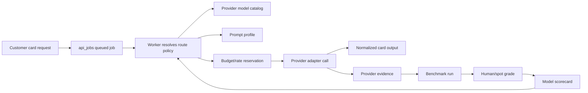

# AI provider control plane

Date: 2026-06-15

## Original brief

> I want to kind of decouple the product from the provider of AI generation and stuff. Like, what we're doing is being a service that provides greeting cards, and we are experts in configuring AI providers, getting the best competitive price for doing this. So, let's think about how we can build our software to be a strength in that way. So, every time we run a benchmark test, we should be persisting the grades, and we should be able to import provider catalogs and change things pretty easily. I think it's really important to decouple what's configured from what the image generation or text generation request is. Like, we have a queue, so we should have the workers that pull that queue route the work to the providers that are available and not surface provider errors to the user. For example, I would really like to be able to change providers and prompt settings on the fly without having to redeploy the service and be able to track and spot check or spot grade providers' results for review and grading. I would like to, I don't know, like, I looked at DeepSeek stuff, the images it generated, and most of them look really good, so I'm not sure why the DeepSeek model grade is low. So I would like to have a built-in model benchmark loop that I can run manually and grade up on the admin UI. I think that it's really important that for providers we configure that we have strict rate limit adherences configured by the admins so that if there's an issue with a provider only giving a promotion up to a certain amount of credits, I want there to be our own checks making sure we stay within that limit and also API cost checking our rate limits and usages to avoid overages.

Follow-up source: DeepAI `text2img` provider page, <https://deepai.org/machine-learning-model/text2img>.

Anchor terms for repo-local checks: DeepAI text2img, runtime config.

## Evidence

Repo-local evidence:

- `src/aiFlowConfigData.mjs` already separates card-copy and card-image flow config, budgets, rate limits, prompt settings, queue flags, and fallback queues.
- `src/providerOperations.ts` already plans provider failover and writes `provider_call_events`-shaped spend/fallback evidence.
- `scripts/worker-runtime.mjs` already leases queued jobs from `api_jobs` with bounded retries and terminal dead-letter behavior.
- `src/benchmarkResults.ts` and `src/benchmarkResultsData.ts` already expose benchmark records, manual grade parsing, evidence links, and a visible-quality recommendation gate.
- Latest DeepAI fixed-provider evidence is `model-benchmark-20260614-fixed-provider-requests`: product 66/100, contract 94/100, 4 successful DeepAI POSTs, native `negative_prompt`, and no customer-quality promotion.

External evidence:

- DeepAI docs define `POST https://api.deepai.org/api/text2img`, `api-key` auth, form-data inputs, `width`, `height`, `image_generator_version`, `resolution`, `genius_preference`, and `negative_prompt`: <https://deepai.org/docs>.
- DeepAI pricing/page copy lists Pro image allowances and overages: standard/HD roughly $0.01 each after allowance, Genius $0.08, Super Genius 2K $0.25: <https://deepai.org/pricing> and <https://deepai.org/machine-learning-model/text2img>.
- Cloudflare Workers AI publishes model catalog and pricing, including Qwen3 30B and image model pricing: <https://developers.cloudflare.com/workers-ai/platform/pricing/> and <https://developers.cloudflare.com/workers-ai/models/qwen3-30b-a3b-fp8/>.
- Cloudflare AI Gateway documents analytics, logging, caching, rate limiting, retries, and model fallback as an AI control-plane pattern: <https://developers.cloudflare.com/ai-gateway/>.
- Cloudflare Queues and AWS queue guidance both support retry/DLQ-backed async execution rather than live provider calls on the request path: <https://developers.cloudflare.com/queues/configuration/dead-letter-queues/> and <https://docs.aws.amazon.com/AWSSimpleQueueService/latest/SQSDeveloperGuide/sqs-best-practices.html>.
- OpenTelemetry GenAI conventions provide provider/model/usage/evaluation telemetry names, with warnings that raw messages can contain sensitive data: <https://opentelemetry.io/docs/specs/semconv/registry/attributes/gen-ai/>.

Inference from evidence:

- CustomCard's advantage should be an internal control plane that can import/catalog providers, route jobs by policy, enforce budgets before calls, and promote models only from persisted benchmark grades.
- Provider error detail is operator evidence, not customer copy. Customers should see generic queued/completed/fallback status while admin tools preserve provider failure evidence.
- DeepAI standard is currently a good contract-compliance candidate, not a customer-ready visible product route.

## Product story

As a CustomCard operator, I can import or configure AI provider models, route queued generation work through runtime policies, persist benchmark grades, and promote provider routes only when quality, contract, reliability, cost, and rate-limit gates pass, so CustomCard can optimize AI quality and price without redeploying or leaking provider failures to customers.

## Architecture

The product request stays provider-agnostic:

1. Customer/API code creates a greeting-card generation job with sanitized story, occasion, and recipient inputs.
2. The worker leases the queued job and resolves the latest trusted route policy for `card-copy` and `card-image`.
3. The route policy maps to provider model catalog rows, prompt profile rows, budget/rate gates, and fallback policy.
4. The worker reserves cost/rate capacity in `provider_call_events` before any live provider call.
5. Provider adapters execute the configured request defaults, such as DeepAI `image_generator_version` and native `negative_prompt`.
6. Provider responses are normalized into card artifacts or safe fallbacks. Provider errors stay in admin evidence.
7. Benchmark runs and grades are persisted separately from the runtime request, then roll up into scorecards and promotion recommendations.

## Data contract

Implemented migration: `infra/migrations/005_ai_provider_control_plane.sql`.

- `ai_provider_models`: provider catalog imports, model ids, capability, status, cost policy, quality gate, source URLs.
- `ai_prompt_profiles`: prompt versions, request defaults, schema contracts, and summarized instructions without raw customer prompts.
- `ai_route_policies`: runtime-editable flow policies, candidate/fallback model ids, budgets, rate limits, queue requirement, and `customer_error_policy = 'generic-status-only'`.
- `ai_benchmark_runs`: run metadata, story id, status, evidence links, and provider call references.
- `ai_benchmark_grades`: manual/AI/failure grades with product, contract, and route reliability scores.

No table stores raw prompts by default; all tables carry `pii_free = TRUE` and `raw_prompt_stored = FALSE` checks.

## Admin UX contract

Use a dense operations dashboard, not a marketing page:

- Provider catalog table: provider, model, capability, status, cost unit, docs/source, current route use.
- Route policy editor: flow, primary/fallback order, max per-request cost, monthly cap, rate limit, queue required, customer error policy.
- Benchmark scorecards: latest grade, best product score, contract score, route reliability, evidence link, promotion state.
- Review queue: ungraded benchmark runs and spot-check candidates.
- Promotion action: disabled unless scorecard gates pass and current budget/rate policy is valid.

Visual style should stay utilitarian and scannable. Avoid provider brand color dominance; use status color sparingly for attention and operator confidence.

## Acceptance criteria

- Provider/model catalog is represented as runtime data separate from generation requests.
- DeepAI `text2img` standard, HD, Genius, and Super Genius variants are cataloged with request defaults and cost differences.
- Card-image route policy requires queued execution.
- Route policies use `generic-status-only` customer error policy.
- Benchmark grades persist into dedicated tables with product, contract, and route reliability scores.
- Latest DeepAI fixed run is persisted in benchmark data as 66/94 and remains below the product promotion gate.
- A high-scoring synthetic grade can promote a route only when product, contract, and reliability gates pass.
- A repo doctor verifies catalog, routing, grade persistence, schema, docs, tests, and CI wiring.

## Test spec

Primary tests:

- `src/aiProviderControlPlane.test.ts`: DeepAI catalog variants, route/prompt separation, scorecard promotion gates, persistence migration contract, and generic customer error policy.
- `src/benchmarkResults.test.ts`: latest fixed DeepAI benchmark, improved 66/94 score, and continued customer-quality block.
- `npm run ai:control-plane:doctor`: static repo-local contract check for control-plane source, migration, docs, package script, and CI gate.

Non-goals in this slice:

- Do not run the benchmark loop.
- Do not make live provider calls.
- Do not rework the already dirty admin UI files in this commit.
- Do not claim DeepAI or any other provider is customer-ready until the persisted grade gate says so.
