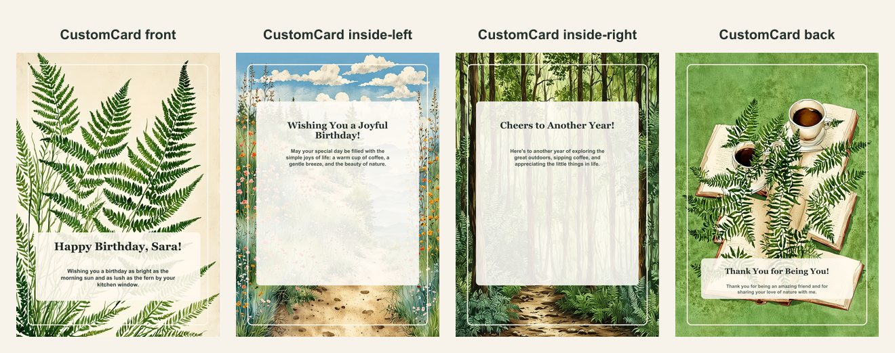

# Personalized botanical birthday card

- Competitor: Hallmark
- Source: https://www.hallmark.com/customized-cards/
- Competitor prompt/category: custom birthday card
- CustomCard generated by: ai-text-and-image
- Card copy model: @cf/meta/llama-3.1-8b-instruct-fast
- Image model: @cf/bytedance/stable-diffusion-xl-lightning
- Panel count: 4

## Panel Prompts

### front

a premium 5x7 vertical greeting card panel featuring a serene botanical watercolor scene of a fern in a delicate morning light with deep green accents on cream paper No readable text. No people. No hands. No logos. No watermark.

Preview: [preview-front.png](./preview-front.png)

### inside-left

a premium 5x7 vertical greeting card panel featuring a watercolor illustration of a trail with tiny wildflowers and a few morning clouds on a light blue background with a subtle texture resembling rough paper No readable text. No people. No hands. No logos. No watermark.

Preview: [preview-inside-left.png](./preview-inside-left.png)

### inside-right

a premium 5x7 vertical greeting card panel featuring a watercolor scene of a serene forest with a winding path, dappled light, and a few ferns on a soft green background with a subtle texture resembling rough paper No readable text. No people. No hands. No logos. No watermark.

Preview: [preview-inside-right.png](./preview-inside-right.png)

### back

a premium 5x7 vertical greeting card panel featuring a watercolor illustration of a fern with a few coffee cups and a book on a small table on a soft green background with a subtle texture resembling rough paper No readable text. No people. No hands. No logos. No watermark.

Preview: [preview-back.png](./preview-back.png)

