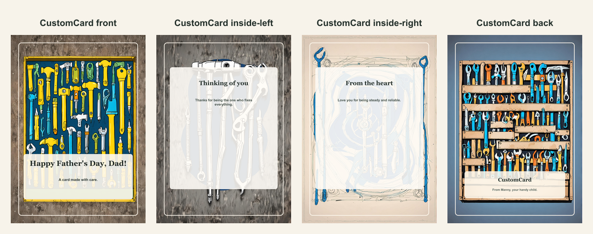

# Father's Day repair-themed card

- Competitor: Greetings Island
- Source: https://www.greetingsisland.com/
- Competitor prompt/category: dad who can fix anything
- CustomCard generated by: ai-text-and-image
- Card copy model: @cf/meta/llama-3.1-8b-instruct-fast
- Image model: @cf/bytedance/stable-diffusion-xl-lightning
- Panel count: 4

## Panel Prompts

### front

A cheerful, golden yellow and green illustration of a toolbox with a hammer and screwdriver, surrounded by a blue circle with a smile, on a premium 5x7 vertical greeting card background No readable text. No people. No hands. No logos. No watermark.

Preview: [preview-front.png](./preview-front.png)

### inside-left

A stylized illustration of a screwdriver and a wrench, surrounded by a few loose screws and a small blue circle, on a premium 5x7 vertical greeting card background No readable text. No people. No hands. No logos. No watermark.

Preview: [preview-inside-left.png](./preview-inside-left.png)

### inside-right

A stylized illustration of a level and a small blue circle, surrounded by a few tools and a blue line, on a premium 5x7 vertical greeting card background No readable text. No people. No hands. No logos. No watermark.

Preview: [preview-inside-right.png](./preview-inside-right.png)

### back

A stylized illustration of a toolbox with a blue circle and a few tools, on a premium 5x7 vertical greeting card background No readable text. No people. No hands. No logos. No watermark.

Preview: [preview-back.png](./preview-back.png)

