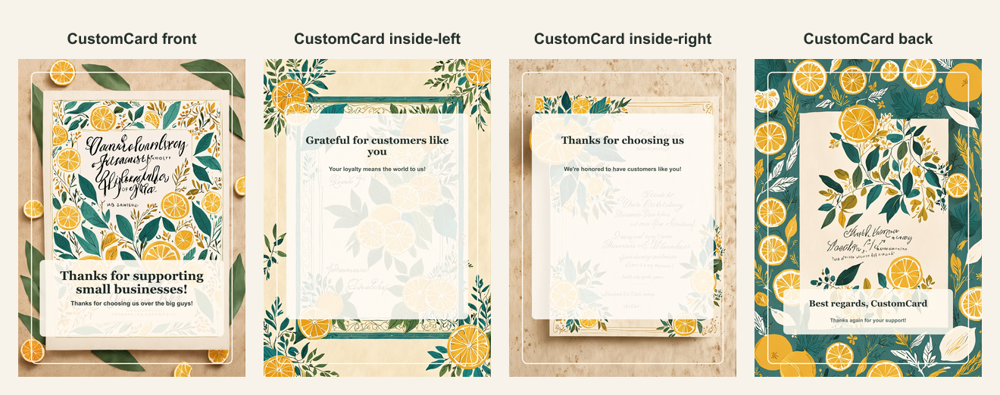

# Small business thank-you AI card

- Competitor: Adobe Express
- Source: https://www.adobe.com/express/create/ai/card
- Competitor prompt/category: thanks for supporting our small business
- CustomCard generated by: ai-text-and-image
- Card copy model: @cf/meta/llama-3.1-8b-instruct-fast
- Image model: @cf/bytedance/stable-diffusion-xl-lightning
- Panel count: 4

## Panel Prompts

### front

A premium 5x7 vertical greeting card front design with the strongest decorative composition and a generous blank area for app-added headline typography. Warm small-business thank-you theme: cream background with citrus, soft gold, and deep teal accents, subtle boutique storefront awning, kraft shopping bag, ribbon, blank gift tag, botanical sprig, and handmade local-shop texture. Premium print-ready composition, clean luxury stationery design, minimal clutter, generous safe margins, no readable text, no logos, no watermark. No people. No hands.

Preview: [preview-front.png](./preview-front.png)

### inside-left

A soft 5x7 vertical greeting card inside-left panel with decorative support artwork around the edges and open space for a short app-added note. Warm small-business thank-you theme: cream background with citrus, soft gold, and deep teal accents, subtle boutique storefront awning, kraft shopping bag, ribbon, blank gift tag, botanical sprig, and handmade local-shop texture. Premium print-ready composition, clean luxury stationery design, minimal clutter, generous safe margins, no readable text, no logos, no watermark. No people. No hands.

Preview: [preview-inside-left.png](./preview-inside-left.png)

### inside-right

A clean 5x7 vertical greeting card inside-right message panel with a calm blank writing area and subtle matching ornamentation. Warm small-business thank-you theme: cream background with citrus, soft gold, and deep teal accents, subtle boutique storefront awning, kraft shopping bag, ribbon, blank gift tag, botanical sprig, and handmade local-shop texture. Premium print-ready composition, clean luxury stationery design, minimal clutter, generous safe margins, no readable text, no logos, no watermark. No people. No hands.

Preview: [preview-inside-right.png](./preview-inside-right.png)

### back

A minimal 5x7 vertical greeting card back cover with mostly negative space and subtle coordinating ornamentation near the lower area. Warm small-business thank-you theme: cream background with citrus, soft gold, and deep teal accents, subtle boutique storefront awning, kraft shopping bag, ribbon, blank gift tag, botanical sprig, and handmade local-shop texture. Premium print-ready composition, clean luxury stationery design, minimal clutter, generous safe margins, no readable text, no logos, no watermark. No people. No hands.

Preview: [preview-back.png](./preview-back.png)

