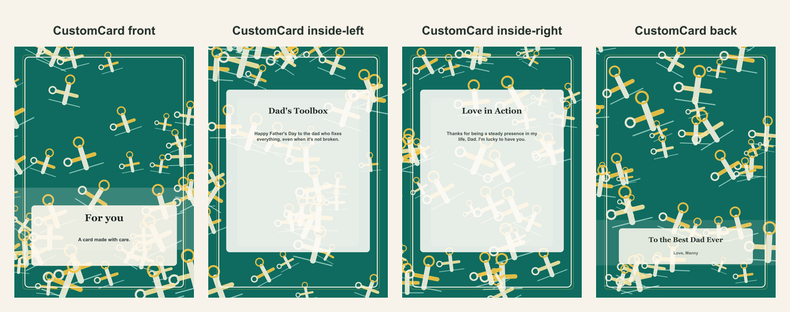

# Father's Day repair-themed card

- Competitor: Greetings Island
- Source: https://www.greetingsisland.com/
- Competitor prompt/category: dad who can fix anything
- CustomCard generated by: ai-text-and-image
- Card copy model: @cf/meta/llama-3.1-8b-instruct-fast
- Image model: @cf/bytedance/stable-diffusion-xl-lightning
- Panel count: 4

## Panel Prompts

### front

A smiling golden wrench with a green handle, surrounded by golden yellow and green accents, on a clean blue background with subtle blueprint details, symbolizing steady presence and practical love. 5x7 vertical print panel. Flat 2D full-bleed digital illustration. No readable text. No words, letters, handwriting, calligraphy, labels, signatures, or fake text. No people. No hands. No logos. No watermark. Not a photo, not a physical paper card, not a folded card mockup, not a tabletop scene, not a product photograph.

Preview: [preview-front.png](./preview-front.png)

### inside-left

A golden yellow toolbox with a green lid, filled with various golden wrenches, pliers, and screwdrivers, on a clean blue background with subtle blueprint details, surrounded by golden yellow and green accents. 5x7 vertical print panel. Flat 2D full-bleed digital illustration. No readable text. No words, letters, handwriting, calligraphy, labels, signatures, or fake text. No people. No hands. No logos. No watermark. Not a photo, not a physical paper card, not a folded card mockup, not a tabletop scene, not a product photograph.

Preview: [preview-inside-left.png](./preview-inside-left.png)

### inside-right

A golden wrench with a green handle, surrounded by a heart made of golden yellow and green accents, on a clean blue background with subtle blueprint details, symbolizing love and practical support. 5x7 vertical print panel. Flat 2D full-bleed digital illustration. No readable text. No words, letters, handwriting, calligraphy, labels, signatures, or fake text. No people. No hands. No logos. No watermark. Not a photo, not a physical paper card, not a folded card mockup, not a tabletop scene, not a product photograph.

Preview: [preview-inside-right.png](./preview-inside-right.png)

### back

Full-bleed flat 2D artwork layer for a minimal vertical 5x7 back print panel; use mostly negative space with subtle coordinating ornamentation near the lower area. Warm Father's Day practical-love background: clean blueprint-inspired field, organized wrench and measuring-tape icons, pencil lines, small hardware details, golden yellow and workshop green accents, polished friendly illustration pattern. Artwork layer only, not a physical card or photographed paper. No inner card rectangle, no frame, no table, no envelope, no label, no sign, no blank tag, no text box, no shadowed paper sheet. Premium print-ready flat artwork, full-bleed 2D composition, minimal clutter, generous safe margins, no readable text, no words, no letters, no numbers, no handwriting, no calligraphy, no faux script, no fake text, no logos, no watermark. No people. No hands.

Preview: [preview-back.png](./preview-back.png)

