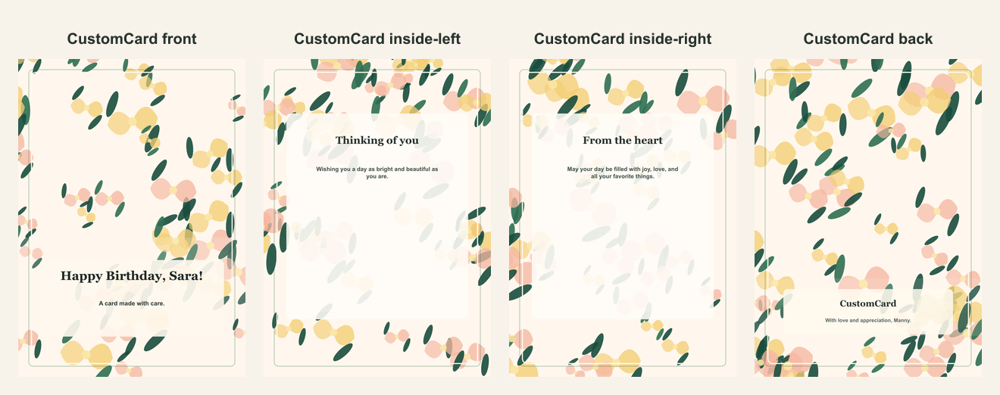

# Personalized botanical birthday card

- Competitor: Hallmark
- Source: https://www.hallmark.com/customized-cards/
- Competitor prompt/category: custom birthday card
- CustomCard generated by: ai-text-and-image
- Card copy model: @cf/meta/llama-3.1-8b-instruct-fast
- Image model: n/a
- Panel count: 4

## Panel Prompts

### front

A watercolor illustration of a fern with morning light streaming through the window, with a few tiny wildflowers scattered around the base, all on a cream-colored background with deep green accents. 5x7 vertical print panel. Flat 2D full-bleed digital illustration. No readable text. No words, letters, handwriting, calligraphy, labels, signatures, or fake text. No people. No hands. No logos. No watermark. Not a photo, not a physical paper card, not a folded card mockup, not a tabletop scene, not a product photograph.

Preview: [preview-front.png](./preview-front.png)

### inside-left

A delicate watercolor illustration of a few wildflowers blooming along a winding morning hike trail, with the fern from the front panel peeking out from behind a rock in the distance, all on a cream-colored background with deep green accents. 5x7 vertical print panel. Flat 2D full-bleed digital illustration. No readable text. No words, letters, handwriting, calligraphy, labels, signatures, or fake text. No people. No hands. No logos. No watermark. Not a photo, not a physical paper card, not a folded card mockup, not a tabletop scene, not a product photograph.

Preview: [preview-inside-left.png](./preview-inside-left.png)

### inside-right

A whimsical watercolor illustration of a coffee cup and saucer on a small wooden table, surrounded by a few sprigs of fresh fern and a few wildflowers, all on a cream-colored background with deep green accents. 5x7 vertical print panel. Flat 2D full-bleed digital illustration. No readable text. No words, letters, handwriting, calligraphy, labels, signatures, or fake text. No people. No hands. No logos. No watermark. Not a photo, not a physical paper card, not a folded card mockup, not a tabletop scene, not a product photograph.

Preview: [preview-inside-right.png](./preview-inside-right.png)

### back

A simple watercolor illustration of a small potted fern on a windowsill, with a few wildflowers scattered around the base, all on a cream-colored background with deep green accents. 5x7 vertical print panel. Flat 2D full-bleed digital illustration. No readable text. No words, letters, handwriting, calligraphy, labels, signatures, or fake text. No people. No hands. No logos. No watermark. Not a photo, not a physical paper card, not a folded card mockup, not a tabletop scene, not a product photograph.

Preview: [preview-back.png](./preview-back.png)

