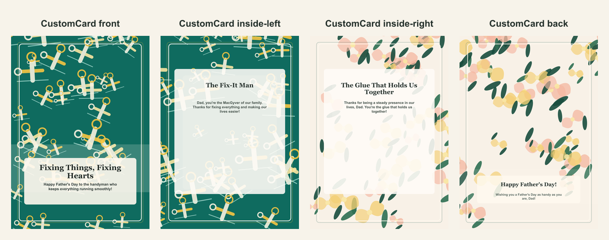

# Father's Day repair-themed card

- Competitor: Greetings Island
- Source: https://www.greetingsisland.com/
- Competitor prompt/category: dad who can fix anything
- CustomCard generated by: ai-text-and-image
- Card copy model: @cf/meta/llama-3.1-8b-instruct-fast
- Image model: n/a
- Panel count: 4

## Panel Prompts

### front

A golden wrench with a green handle, surrounded by blueprints, with a few yellow tools scattered around it, all on a clean white background. The wrench is the main focus, with the blueprints and tools providing a subtle background. The illustration style is a mix of clean lines and subtle textures, reminiscent of a blueprint. The color palette is primarily yellow and green, with accents of blue and white. 5x7 vertical print panel. Flat 2D full-bleed digital illustration. No readable text. No words, letters, handwriting, calligraphy, labels, signatures, or fake text. No people. No hands. No logos. No watermark. Not a photo, not a physical paper card, not a folded card mockup, not a tabletop scene, not a product photograph.

Preview: [preview-front.png](./preview-front.png)

### inside-left

Full-bleed flat 2D artwork layer for a vertical 5x7 inside-left print panel; use a subtle low-contrast decorative pattern with gentle edge emphasis. Warm Father's Day practical-love background: clean blueprint-inspired field, organized wrench and measuring-tape icons, pencil lines, small hardware details, golden yellow and workshop green accents, polished friendly illustration pattern. Artwork layer only, not a physical card or photographed paper. No inner card rectangle, no frame, no table, no envelope, no label, no sign, no blank tag, no text box, no shadowed paper sheet. Premium print-ready flat artwork, full-bleed 2D composition, minimal clutter, generous safe margins, no readable text, no words, no letters, no numbers, no handwriting, no calligraphy, no faux script, no fake text, no logos, no watermark. No people. No hands.

Preview: [preview-inside-left.png](./preview-inside-left.png)

### inside-right

A stylized illustration of a glue stick, surrounded by a few tools and blueprints, all on a white background. The glue stick is depicted in a simple, cartoonish style, with a few subtle textures to give it a sense of depth. The color palette is primarily yellow and green, with accents of blue and white. 5x7 vertical print panel. Flat 2D full-bleed digital illustration. No readable text. No words, letters, handwriting, calligraphy, labels, signatures, or fake text. No people. No hands. No logos. No watermark. Not a photo, not a physical paper card, not a folded card mockup, not a tabletop scene, not a product photograph.

Preview: [preview-inside-right.png](./preview-inside-right.png)

### back

A stylized illustration of a few tools and blueprints, all on a white background. The tools are depicted in a simple, cartoonish style, with a few subtle textures to give it a sense of depth. The color palette is primarily yellow and green, with accents of blue and white. 5x7 vertical print panel. Flat 2D full-bleed digital illustration. No readable text. No words, letters, handwriting, calligraphy, labels, signatures, or fake text. No people. No hands. No logos. No watermark. Not a photo, not a physical paper card, not a folded card mockup, not a tabletop scene, not a product photograph.

Preview: [preview-back.png](./preview-back.png)

