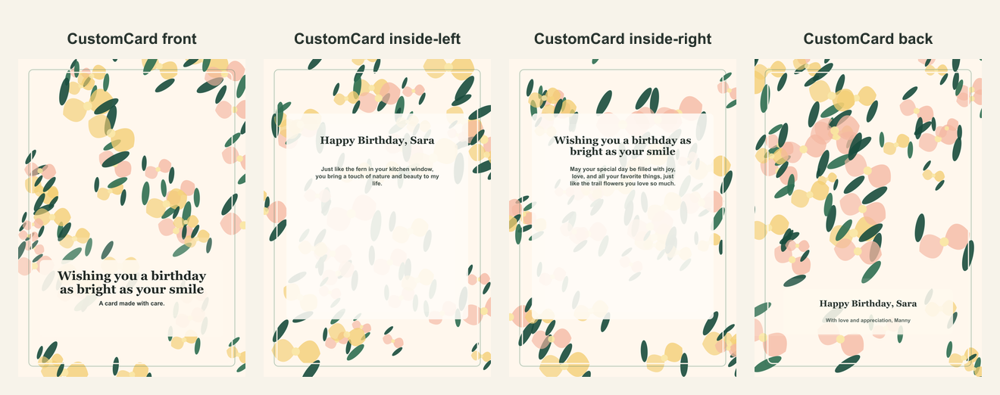

# Personalized botanical birthday card

- Competitor: Hallmark
- Source: https://www.hallmark.com/customized-cards/
- Competitor prompt/category: custom birthday card
- CustomCard generated by: ai-text-and-image
- Card copy model: @cf/meta/llama-3.1-8b-instruct-fast
- Image model: n/a
- Panel count: 4

## Panel Prompts

### front

a lush, green fern in a delicate, cream-colored planter, with a few morning light rays peeking through the window, and a subtle, watercolor-style birthday banner in the background, with a few tiny, colorful flowers scattered around the planter 5x7 vertical print panel. Flat 2D full-bleed digital illustration. No readable text. No words, letters, handwriting, calligraphy, labels, signatures, or fake text. No people. No hands. No logos. No watermark. Not a photo, not a physical paper card, not a folded card mockup, not a tabletop scene, not a product photograph.

Preview: [preview-front.png](./preview-front.png)

### inside-left

a delicate, watercolor-style illustration of a few tiny, colorful flowers from a morning hike, surrounded by a few sprigs of fern and a few morning light rays, with a subtle, cream-colored background 5x7 vertical print panel. Flat 2D full-bleed digital illustration. No readable text. No words, letters, handwriting, calligraphy, labels, signatures, or fake text. No people. No hands. No logos. No watermark. Not a photo, not a physical paper card, not a folded card mockup, not a tabletop scene, not a product photograph.

Preview: [preview-inside-left.png](./preview-inside-left.png)

### inside-right

a beautiful, watercolor-style illustration of a lush, green fern in a delicate, cream-colored planter, surrounded by a few morning light rays and a few tiny, colorful flowers, with a subtle, birthday-themed background 5x7 vertical print panel. Flat 2D full-bleed digital illustration. No readable text. No words, letters, handwriting, calligraphy, labels, signatures, or fake text. No people. No hands. No logos. No watermark. Not a photo, not a physical paper card, not a folded card mockup, not a tabletop scene, not a product photograph.

Preview: [preview-inside-right.png](./preview-inside-right.png)

### back

a simple, watercolor-style illustration of a few sprigs of fern and a few morning light rays, with a subtle, cream-colored background and a few tiny, colorful flowers scattered around the edges 5x7 vertical print panel. Flat 2D full-bleed digital illustration. No readable text. No words, letters, handwriting, calligraphy, labels, signatures, or fake text. No people. No hands. No logos. No watermark. Not a photo, not a physical paper card, not a folded card mockup, not a tabletop scene, not a product photograph.

Preview: [preview-back.png](./preview-back.png)

