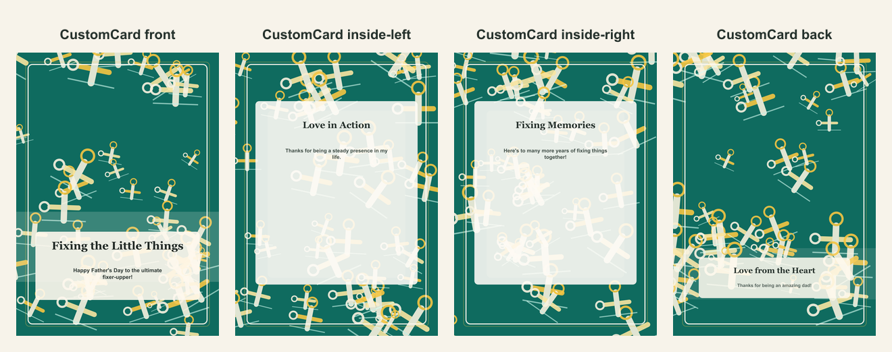

# Father's Day repair-themed card

- Competitor: Greetings Island
- Source: https://www.greetingsisland.com/
- Competitor prompt/category: dad who can fix anything
- CustomCard generated by: ai-text-and-image
- Card copy model: @cf/meta/llama-3.1-8b-instruct-fast
- Image model: n/a
- Panel count: 4

## Panel Prompts

### front

A cheerful illustration of a hammer and screwdriver surrounded by golden yellow and green accents, with a subtle blueprint pattern in the background. The tools are positioned in a symmetrical composition, with a few loose screws scattered around to convey a sense of fixing and repair. 5x7 vertical print panel. Flat 2D full-bleed digital illustration. No readable text. No words, letters, handwriting, calligraphy, labels, signatures, or fake text. No people. No hands. No logos. No watermark. Not a photo, not a physical paper card, not a folded card mockup, not a tabletop scene, not a product photograph.

Preview: [preview-front.png](./preview-front.png)

### inside-left

An illustration of a level tool with a green light shining, surrounded by a subtle blueprint pattern and golden yellow accents. The level is positioned in the center of the composition, with a few tools and gears scattered around to convey a sense of balance and stability. 5x7 vertical print panel. Flat 2D full-bleed digital illustration. No readable text. No words, letters, handwriting, calligraphy, labels, signatures, or fake text. No people. No hands. No logos. No watermark. Not a photo, not a physical paper card, not a folded card mockup, not a tabletop scene, not a product photograph.

Preview: [preview-inside-left.png](./preview-inside-left.png)

### inside-right

An illustration of a toolbox with a few tools and gadgets spilling out, surrounded by a subtle blueprint pattern and golden yellow accents. The toolbox is positioned in the center of the composition, with a few loose tools and screws scattered around to convey a sense of fixing and repair. 5x7 vertical print panel. Flat 2D full-bleed digital illustration. No readable text. No words, letters, handwriting, calligraphy, labels, signatures, or fake text. No people. No hands. No logos. No watermark. Not a photo, not a physical paper card, not a folded card mockup, not a tabletop scene, not a product photograph.

Preview: [preview-inside-right.png](./preview-inside-right.png)

### back

An illustration of a heart-shaped wrench surrounded by a subtle blueprint pattern and golden yellow accents. The wrench is positioned in the center of the composition, with a few tools and gears scattered around to convey a sense of love and repair. 5x7 vertical print panel. Flat 2D full-bleed digital illustration. No readable text. No words, letters, handwriting, calligraphy, labels, signatures, or fake text. No people. No hands. No logos. No watermark. Not a photo, not a physical paper card, not a folded card mockup, not a tabletop scene, not a product photograph.

Preview: [preview-back.png](./preview-back.png)

