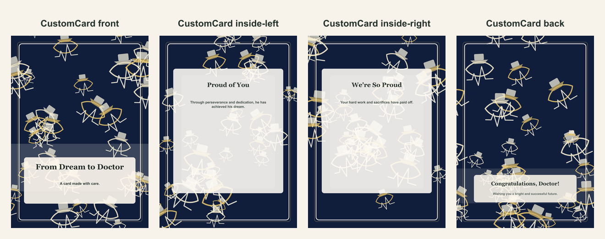

# Medical school graduation folded card

- Competitor: Shutterfly
- Source: https://www.shutterfly.com/cards-stationery/
- Competitor prompt/category: graduation milestone card
- CustomCard generated by: ai-text-and-image
- Card copy model: @cf/meta/llama-3.1-8b-instruct-fast
- Image model: n/a
- Panel count: 4

## Panel Prompts

### front

A deep navy background with a white graduation cap on top, a white stethoscope hanging from the cap's top, and a soft gold medical symbol at the bottom. Anatomy sketch lines and ECG lines decorate the background, and a white coat hangs on the side. 5x7 vertical print panel. Flat 2D full-bleed digital illustration. No readable text. No words, letters, handwriting, calligraphy, labels, signatures, or fake text. No people. No hands. No logos. No watermark. Not a photo, not a physical paper card, not a folded card mockup, not a tabletop scene, not a product photograph.

Preview: [preview-front.png](./preview-front.png)

### inside-left

A soft gold medical symbol with a white stethoscope wrapped around it, set against a deep navy background. Anatomy sketch lines and ECG lines decorate the background, and a white coat hangs on the side. 5x7 vertical print panel. Flat 2D full-bleed digital illustration. No readable text. No words, letters, handwriting, calligraphy, labels, signatures, or fake text. No people. No hands. No logos. No watermark. Not a photo, not a physical paper card, not a folded card mockup, not a tabletop scene, not a product photograph.

Preview: [preview-inside-left.png](./preview-inside-left.png)

### inside-right

A white graduation cap with a soft gold medical symbol at the top, set against a deep navy background. A white stethoscope hangs from the cap's top, and anatomy sketch lines and ECG lines decorate the background. 5x7 vertical print panel. Flat 2D full-bleed digital illustration. No readable text. No words, letters, handwriting, calligraphy, labels, signatures, or fake text. No people. No hands. No logos. No watermark. Not a photo, not a physical paper card, not a folded card mockup, not a tabletop scene, not a product photograph.

Preview: [preview-inside-right.png](./preview-inside-right.png)

### back

A white coat with a soft gold medical symbol on the pocket, set against a deep navy background. A white stethoscope hangs from the coat's pocket, and anatomy sketch lines and ECG lines decorate the background. 5x7 vertical print panel. Flat 2D full-bleed digital illustration. No readable text. No words, letters, handwriting, calligraphy, labels, signatures, or fake text. No people. No hands. No logos. No watermark. Not a photo, not a physical paper card, not a folded card mockup, not a tabletop scene, not a product photograph.

Preview: [preview-back.png](./preview-back.png)

