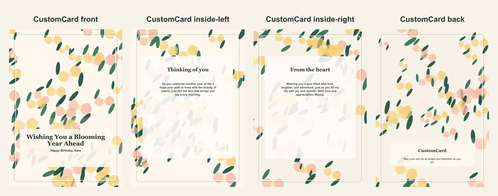

# Personalized botanical birthday card

- Competitor: Hallmark
- Source: https://www.hallmark.com/customized-cards/
- Competitor prompt/category: custom birthday card
- CustomCard generated by: ai-text-and-image
- Card copy model: @cf/meta/llama-3.1-8b-instruct-fast
- Image model: @cf/bytedance/stable-diffusion-xl-lightning
- Panel count: 4

## Panel Prompts

### front

Full-bleed flat 2D artwork layer for the front of a premium vertical 5x7 print panel; fill the canvas edge to edge with decorative background artwork and keep the lower third slightly less busy. Warm birthday background: botanical greenery, soft flowers, small candle shapes, cheerful confetti, morning-light palette, refined celebratory illustration pattern. Artwork layer only, not a physical card or photographed paper. No inner card rectangle, no frame, no table, no envelope, no label, no sign, no blank tag, no text box, no shadowed paper sheet. Premium print-ready flat artwork, full-bleed 2D composition, minimal clutter, generous safe margins, no readable text, no words, no letters, no numbers, no handwriting, no calligraphy, no faux script, no fake text, no logos, no watermark. No people. No hands.

Preview: [preview-front.png](./preview-front.png)

### inside-left

A 5x7 vertical flat print panel artwork featuring a decorative border style with a deep green accent, and a quiet center reserved for a gentle scene-setting message about the fern and the beauty of nature, with a clean text-safe area and generous margins. Flat 2D full-bleed digital illustration. No readable text. No words, letters, handwriting, calligraphy, labels, signatures, or fake text. No people. No hands. No logos. No watermark. Not a photo, not a physical paper card, not a folded card mockup, not a tabletop scene, not a product photograph.

Preview: [preview-inside-left.png](./preview-inside-left.png)

### inside-right

A 5x7 vertical flat print panel artwork featuring a decorative border style with a deep green accent, and a quiet center reserved for a personal message, with a clean text-safe area and generous margins. Flat 2D full-bleed digital illustration. No readable text. No words, letters, handwriting, calligraphy, labels, signatures, or fake text. No people. No hands. No logos. No watermark. Not a photo, not a physical paper card, not a folded card mockup, not a tabletop scene, not a product photograph.

Preview: [preview-inside-right.png](./preview-inside-right.png)

### back

A 5x7 vertical flat print panel artwork featuring a simple border style and a quiet, polished design with a clean text-safe area reserved for a short message, and a low-contrast interior with sparse edge/corner motifs. Flat 2D full-bleed digital illustration. No readable text. No words, letters, handwriting, calligraphy, labels, signatures, or fake text. No people. No hands. No logos. No watermark. Not a photo, not a physical paper card, not a folded card mockup, not a tabletop scene, not a product photograph.

Preview: [preview-back.png](./preview-back.png)

