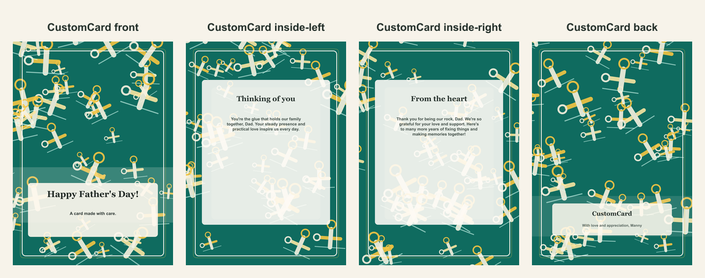

# Father's Day repair-themed card

- Competitor: Greetings Island
- Source: https://www.greetingsisland.com/
- Competitor prompt/category: dad who can fix anything
- CustomCard generated by: ai-text-and-image
- Card copy model: @cf/meta/llama-3.1-8b-instruct-fast
- Image model: @cf/bytedance/stable-diffusion-xl-lightning
- Panel count: 4

## Panel Prompts

### front

Full-bleed flat 2D artwork layer for the front of a premium vertical 5x7 print panel; fill the canvas edge to edge with decorative background artwork and keep the lower third slightly less busy. Warm Father's Day practical-love background: clean blueprint-inspired field, organized wrench and measuring-tape icons, pencil lines, small hardware details, golden yellow and workshop green accents, polished friendly illustration pattern. Artwork layer only, not a physical card or photographed paper. No inner card rectangle, no frame, no table, no envelope, no label, no sign, no blank tag, no text box, no shadowed paper sheet. Premium print-ready flat artwork, full-bleed 2D composition, minimal clutter, generous safe margins, no readable text, no words, no letters, no numbers, no handwriting, no calligraphy, no faux script, no fake text, no logos, no watermark. No people. No hands.

Preview: [preview-front.png](./preview-front.png)

### inside-left

Full-bleed flat 2D artwork layer for a vertical 5x7 inside-left print panel; decorative border/frame design, sparse edge and corner motifs, quiet blank low-contrast center, clean text-safe area, generous safe margins. Warm Father's Day practical-love background: clean blueprint-inspired field, organized wrench and measuring-tape icons, pencil lines, small hardware details, golden yellow and workshop green accents, polished friendly illustration pattern. Artwork layer only, not a physical card or photographed paper. No inner card rectangle, no frame, no table, no envelope, no label, no sign, no blank tag, no text box, no shadowed paper sheet. Premium print-ready flat artwork, full-bleed 2D composition, minimal clutter, generous safe margins, no readable text, no words, no letters, no numbers, no handwriting, no calligraphy, no faux script, no fake text, no logos, no watermark. No people. No hands.

Preview: [preview-inside-left.png](./preview-inside-left.png)

### inside-right

Full-bleed flat 2D artwork layer for a vertical 5x7 inside-right print panel; matching decorative border/frame design, sparse edge and corner motifs, quiet blank low-contrast center, clean text-safe area, generous safe margins. Warm Father's Day practical-love background: clean blueprint-inspired field, organized wrench and measuring-tape icons, pencil lines, small hardware details, golden yellow and workshop green accents, polished friendly illustration pattern. Artwork layer only, not a physical card or photographed paper. No inner card rectangle, no frame, no table, no envelope, no label, no sign, no blank tag, no text box, no shadowed paper sheet. Premium print-ready flat artwork, full-bleed 2D composition, minimal clutter, generous safe margins, no readable text, no words, no letters, no numbers, no handwriting, no calligraphy, no faux script, no fake text, no logos, no watermark. No people. No hands.

Preview: [preview-inside-right.png](./preview-inside-right.png)

### back

Full-bleed flat 2D artwork layer for a minimal vertical 5x7 back print panel; use mostly negative space with subtle coordinating ornamentation near the lower area. Warm Father's Day practical-love background: clean blueprint-inspired field, organized wrench and measuring-tape icons, pencil lines, small hardware details, golden yellow and workshop green accents, polished friendly illustration pattern. Artwork layer only, not a physical card or photographed paper. No inner card rectangle, no frame, no table, no envelope, no label, no sign, no blank tag, no text box, no shadowed paper sheet. Premium print-ready flat artwork, full-bleed 2D composition, minimal clutter, generous safe margins, no readable text, no words, no letters, no numbers, no handwriting, no calligraphy, no faux script, no fake text, no logos, no watermark. No people. No hands.

Preview: [preview-back.png](./preview-back.png)

