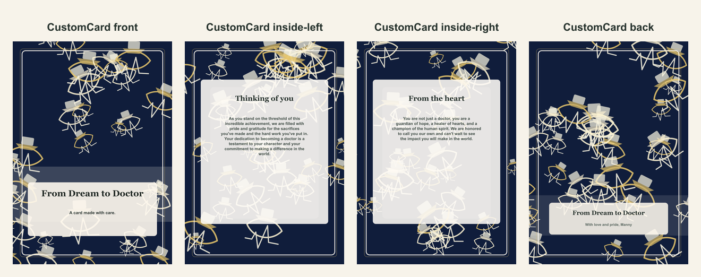

# Medical school graduation folded card

- Competitor: Shutterfly
- Source: https://www.shutterfly.com/cards-stationery/
- Competitor prompt/category: graduation milestone card
- CustomCard generated by: ai-text-and-image
- Card copy model: @cf/meta/llama-3.1-8b-instruct-fast
- Image model: @cf/bytedance/stable-diffusion-xl-lightning
- Panel count: 4

## Panel Prompts

### front

A deep navy background with a white coat and stethoscope at the top, a graduation cap at the bottom, and a subtle ECG line background, with a 5x7 clean text-safe area reserved for the recipient's name. Flat 2D full-bleed digital illustration. No readable text. No words, letters, handwriting, calligraphy, labels, signatures, or fake text. No people. No hands. No logos. No watermark. Not a photo, not a physical paper card, not a folded card mockup, not a tabletop scene, not a product photograph.

Preview: [preview-front.png](./preview-front.png)

### inside-left

A decorative border or frame with a quiet center, a clean text-safe area for the app-rendered text, generous margins, a low-contrast interior, and sparse edge/corner motifs, with a subtle ECG line background and a white coat and stethoscope at the edges. 5x7 vertical print panel. Flat 2D full-bleed digital illustration. No readable text. No words, letters, handwriting, calligraphy, labels, signatures, or fake text. No people. No hands. No logos. No watermark. Not a photo, not a physical paper card, not a folded card mockup, not a tabletop scene, not a product photograph.

Preview: [preview-inside-left.png](./preview-inside-left.png)

### inside-right

A decorative border or frame with a quiet center, a clean text-safe area for the app-rendered text, generous margins, a low-contrast interior, and sparse edge/corner motifs, with a subtle ECG line background and a white coat and stethoscope at the edges. 5x7 vertical print panel. Flat 2D full-bleed digital illustration. No readable text. No words, letters, handwriting, calligraphy, labels, signatures, or fake text. No people. No hands. No logos. No watermark. Not a photo, not a physical paper card, not a folded card mockup, not a tabletop scene, not a product photograph.

Preview: [preview-inside-right.png](./preview-inside-right.png)

### back

Full-bleed flat 2D artwork layer for a minimal vertical 5x7 back print panel; use mostly negative space with subtle coordinating ornamentation near the lower area. Elegant medical-school graduation background: deep navy field with soft gold accents, simple white coat silhouette, graduation cap icon, stethoscope line forming a subtle heart, faint unlabeled anatomical linework texture, and quiet ECG heartbeat motif. Artwork layer only, not a physical card or photographed paper. No inner card rectangle, no frame, no table, no envelope, no label, no sign, no blank tag, no text box, no shadowed paper sheet. Premium print-ready flat artwork, full-bleed 2D composition, minimal clutter, generous safe margins, no readable text, no words, no letters, no numbers, no handwriting, no calligraphy, no faux script, no fake text, no logos, no watermark. No people. No hands.

Preview: [preview-back.png](./preview-back.png)

