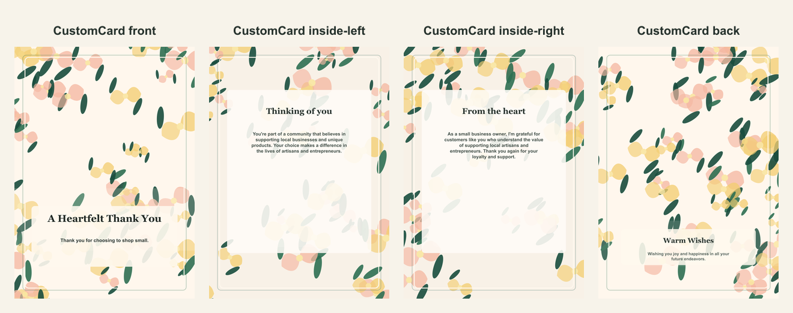

# Small business thank-you AI card

- Competitor: Adobe Express
- Source: https://www.adobe.com/express/create/ai/card
- Competitor prompt/category: thanks for supporting our small business
- CustomCard generated by: ai-text-and-image
- Card copy model: @cf/meta/llama-3.1-8b-instruct-fast
- Image model: @cf/bytedance/stable-diffusion-xl-lightning
- Panel count: 4

## Panel Prompts

### front

Full-bleed flat 2D artwork layer for the front of a premium vertical 5x7 print panel; fill the canvas edge to edge with decorative background artwork and keep the lower third slightly less busy. Warm small-business thank-you background: cream field with citrus slices, soft gold ribbon curves, deep teal leaves, subtle boutique awning silhouette, kraft paper texture, botanical sprigs, and handmade local-shop pattern details. Artwork layer only, not a physical card or photographed paper. No inner card rectangle, no frame, no table, no envelope, no label, no sign, no blank tag, no text box, no shadowed paper sheet. Premium print-ready flat artwork, full-bleed 2D composition, minimal clutter, generous safe margins, no readable text, no words, no letters, no numbers, no handwriting, no calligraphy, no faux script, no fake text, no logos, no watermark. No people. No hands.

Preview: [preview-front.png](./preview-front.png)

### inside-left

A premium 5x7 vertical flat print panel artwork featuring a decorative border or frame with a calm blank/low-contrast center, reserved for app-rendered text. The border should be a mix of natural motifs and subtle patterns, with a low-contrast interior and sparse edge/corner motifs. The palette should match the front panel. Flat 2D full-bleed digital illustration. No readable text. No words, letters, handwriting, calligraphy, labels, signatures, or fake text. No people. No hands. No logos. No watermark. Not a photo, not a physical paper card, not a folded card mockup, not a tabletop scene, not a product photograph.

Preview: [preview-inside-left.png](./preview-inside-left.png)

### inside-right

A premium 5x7 vertical flat print panel artwork featuring a decorative border or frame with a calm blank/low-contrast center, reserved for app-rendered text. The border should be a mix of natural motifs and subtle patterns, with a low-contrast interior and sparse edge/corner motifs. The palette should match the front panel. The center should be clean and text-safe, with generous margins. Flat 2D full-bleed digital illustration. No readable text. No words, letters, handwriting, calligraphy, labels, signatures, or fake text. No people. No hands. No logos. No watermark. Not a photo, not a physical paper card, not a folded card mockup, not a tabletop scene, not a product photograph.

Preview: [preview-inside-right.png](./preview-inside-right.png)

### back

Full-bleed flat 2D artwork layer for a minimal vertical 5x7 back print panel; use mostly negative space with subtle coordinating ornamentation near the lower area. Warm small-business thank-you background: cream field with citrus slices, soft gold ribbon curves, deep teal leaves, subtle boutique awning silhouette, kraft paper texture, botanical sprigs, and handmade local-shop pattern details. Artwork layer only, not a physical card or photographed paper. No inner card rectangle, no frame, no table, no envelope, no label, no sign, no blank tag, no text box, no shadowed paper sheet. Premium print-ready flat artwork, full-bleed 2D composition, minimal clutter, generous safe margins, no readable text, no words, no letters, no numbers, no handwriting, no calligraphy, no faux script, no fake text, no logos, no watermark. No people. No hands.

Preview: [preview-back.png](./preview-back.png)

