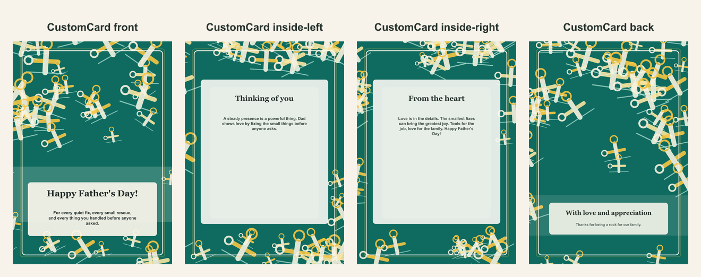

# Father's Day repair-themed card

- Competitor: Greetings Island
- Source: https://www.greetingsisland.com/
- Competitor prompt/category: dad who can fix anything
- CustomCard generated by: ai-text-and-image
- Card copy model: @cf/meta/llama-3.1-8b-instruct-fast
- Image model: @cf/bytedance/stable-diffusion-xl-lightning
- Panel count: 4

## Panel Prompts

### front

Full-bleed flat 2D artwork layer for the front of a premium vertical 5x7 print panel; fill the canvas edge to edge with decorative background artwork and keep the lower third slightly less busy. Warm Father's Day practical-love background: clean blueprint-inspired field, organized wrench and measuring-tape icons, pencil lines, small hardware details, golden yellow and workshop green accents, polished friendly illustration pattern. Artwork layer only, not a physical card or photographed paper. No inner card rectangle, no frame, no table, no envelope, no label, no sign, no blank tag, no text box, no shadowed paper sheet. Premium print-ready flat artwork, full-bleed 2D composition, minimal clutter, generous safe margins, no readable text, no words, no letters, no numbers, no handwriting, no calligraphy, no faux script, no fake text, no logos, no watermark. No people. No hands.

Preview: [preview-front.png](./preview-front.png)

### inside-left

A decorative golden yellow and green border surrounds a quiet, low-contrast center with a clean text-safe area, featuring a subtle hammer and screwdriver motif, with generous margins and sparse edge/corner motifs. 5x7 vertical print panel. Flat 2D full-bleed digital illustration. No readable text. No words, letters, handwriting, calligraphy, labels, signatures, or fake text. No people. No hands. No logos. No watermark. Not a photo, not a physical paper card, not a folded card mockup, not a tabletop scene, not a product photograph.

Preview: [preview-inside-left.png](./preview-inside-left.png)

### inside-right

A decorative golden yellow and green border surrounds a quiet, low-contrast center with a clean text-safe area, featuring a subtle hammer and screwdriver motif, with generous margins and sparse edge/corner motifs, and a prominent golden yellow and green text area for the closing message. 5x7 vertical print panel. Flat 2D full-bleed digital illustration. No readable text. No words, letters, handwriting, calligraphy, labels, signatures, or fake text. No people. No hands. No logos. No watermark. Not a photo, not a physical paper card, not a folded card mockup, not a tabletop scene, not a product photograph.

Preview: [preview-inside-right.png](./preview-inside-right.png)

### back

A cheerful, golden yellow and green workshop illustration with a prominent hammer and screwdriver, surrounded by clean, white space, with a generous text area for the closing message at the bottom. 5x7 vertical print panel. Flat 2D full-bleed digital illustration. No readable text. No words, letters, handwriting, calligraphy, labels, signatures, or fake text. No people. No hands. No logos. No watermark. Not a photo, not a physical paper card, not a folded card mockup, not a tabletop scene, not a product photograph.

Preview: [preview-back.png](./preview-back.png)

