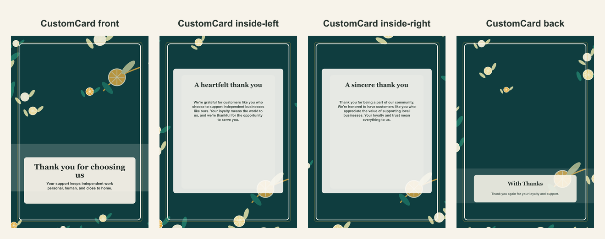

# Small business thank-you AI card

- Competitor: Adobe Express
- Source: https://www.adobe.com/express/create/ai/card
- Competitor prompt/category: thanks for supporting our small business
- CustomCard generated by: ai-text-and-image
- Card copy model: @cf/meta/llama-3.1-8b-instruct-fast
- Image model: @cf/bytedance/stable-diffusion-xl-lightning
- Panel count: 4

## Panel Prompts

### front

Full-bleed flat 2D artwork layer for the front of a premium vertical 5x7 print panel; choose one dominant hero visual or sparse line-art composition, keep a clean text-safe area, and avoid all-over motif wallpaper. Warm small-business thank-you stationery: cream or deep teal field with a controlled citrus-and-leaf corner arrangement, soft gold ribbon curve, subtle boutique awning silhouette, kraft paper texture, and editorial negative space; use border and corner hierarchy, not a busy repeated fruit pattern. Artwork layer only, not a physical card or photographed paper. No inner card rectangle, no mockup frame, no table, no envelope, no label, no sign, no blank tag, no text box, no shadowed paper sheet. Decorative print borders are allowed. Premium print-ready flat artwork, full-bleed 2D composition, minimal clutter, disciplined negative space, no all-over repeating wallpaper pattern, generous safe margins, no readable text, no words, no letters, no numbers, no handwriting, no calligraphy, no faux script, no fake text, no logos, no watermark. No people. No hands.

Preview: [preview-front.png](./preview-front.png)

### inside-left

Full-bleed flat 2D artwork layer for a vertical 5x7 inside-left print panel; border-first stationery layout, thin refined frame, sparse edge/corner or lower-edge motifs, quiet blank low-contrast center, clean text-safe area, generous safe margins. Warm small-business thank-you stationery: cream or deep teal field with a controlled citrus-and-leaf corner arrangement, soft gold ribbon curve, subtle boutique awning silhouette, kraft paper texture, and editorial negative space; use border and corner hierarchy, not a busy repeated fruit pattern. Artwork layer only, not a physical card or photographed paper. No inner card rectangle, no mockup frame, no table, no envelope, no label, no sign, no blank tag, no text box, no shadowed paper sheet. Decorative print borders are allowed. Premium print-ready flat artwork, full-bleed 2D composition, minimal clutter, disciplined negative space, no all-over repeating wallpaper pattern, generous safe margins, no readable text, no words, no letters, no numbers, no handwriting, no calligraphy, no faux script, no fake text, no logos, no watermark. No people. No hands.

Preview: [preview-inside-left.png](./preview-inside-left.png)

### inside-right

Full-bleed flat 2D artwork layer for a vertical 5x7 inside-right print panel; matching border-first stationery layout, thin refined frame, sparse edge/corner or lower-edge motifs, quiet blank low-contrast center, clean text-safe area, generous safe margins. Warm small-business thank-you stationery: cream or deep teal field with a controlled citrus-and-leaf corner arrangement, soft gold ribbon curve, subtle boutique awning silhouette, kraft paper texture, and editorial negative space; use border and corner hierarchy, not a busy repeated fruit pattern. Artwork layer only, not a physical card or photographed paper. No inner card rectangle, no mockup frame, no table, no envelope, no label, no sign, no blank tag, no text box, no shadowed paper sheet. Decorative print borders are allowed. Premium print-ready flat artwork, full-bleed 2D composition, minimal clutter, disciplined negative space, no all-over repeating wallpaper pattern, generous safe margins, no readable text, no words, no letters, no numbers, no handwriting, no calligraphy, no faux script, no fake text, no logos, no watermark. No people. No hands.

Preview: [preview-inside-right.png](./preview-inside-right.png)

### back

Full-bleed flat 2D artwork layer for a minimal vertical 5x7 back print panel; use mostly negative space with one small coordinating lower mark or border echo. Warm small-business thank-you stationery: cream or deep teal field with a controlled citrus-and-leaf corner arrangement, soft gold ribbon curve, subtle boutique awning silhouette, kraft paper texture, and editorial negative space; use border and corner hierarchy, not a busy repeated fruit pattern. Artwork layer only, not a physical card or photographed paper. No inner card rectangle, no mockup frame, no table, no envelope, no label, no sign, no blank tag, no text box, no shadowed paper sheet. Decorative print borders are allowed. Premium print-ready flat artwork, full-bleed 2D composition, minimal clutter, disciplined negative space, no all-over repeating wallpaper pattern, generous safe margins, no readable text, no words, no letters, no numbers, no handwriting, no calligraphy, no faux script, no fake text, no logos, no watermark. No people. No hands.

Preview: [preview-back.png](./preview-back.png)

