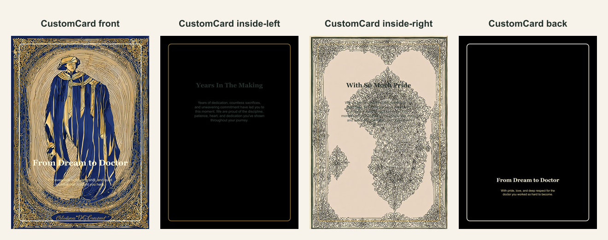

# Medical school graduation folded card

- Competitor: Shutterfly
- Source: https://www.shutterfly.com/cards-stationery/
- Competitor prompt/category: graduation milestone card
- Target bar: Reference medical cards: deep navy/soft gold, one cinematic white-coat hero or sparse ECG line, ivory note-sheet interiors, no scattered icon wallpaper, and direct family-pride copy.
- QA score: 97/100 (needs-improvement)
- QA scorecard: [qa-scorecard.md](./qa-scorecard.md)
- CustomCard generated by: ai-text-and-image
- Card copy model: @cf/meta/llama-3.1-8b-instruct-fast
- Image model: @cf/bytedance/stable-diffusion-xl-lightning
- Panel count: 4

## Panel Prompts

### front

Full-bleed flat 2D artwork layer for the front of a premium vertical 5x7 print panel; choose one dominant hero visual or sparse line-art composition, keep an integrated clean lower or central text-safe area, no caption plaque, and avoid all-over motif wallpaper. Elegant medical-school graduation artwork: deep navy and soft gold, one white coat plus graduation cap and stethoscope hero composition or sparse ECG line; interiors use ivory note-sheet field, thin gold border, lower ECG, one stethoscope corner; never dense repeated medical icons. Artwork layer only, not a physical card or photographed paper. No caption plaque, no inner card rectangle, no mockup frame, no table, no envelope, no label, no sign, no blank tag, no text box, no shadowed paper sheet. Decorative print borders are allowed. Premium print-ready flat artwork, full-bleed 2D composition, minimal clutter, disciplined negative space, no all-over repeating wallpaper pattern, generous safe margins, no readable text, no words, no letters, no numbers, no handwriting, no calligraphy, no faux script, no fake text, no logos, no watermark. No people. No hands.

Preview: [preview-front.png](./preview-front.png)

### inside-left

Full-bleed flat 2D artwork layer for a vertical 5x7 inside-left print panel; light ivory or cream low-contrast note-sheet field, border-first stationery layout, thin refined frame, sparse edge/corner or lower-edge motifs, quiet blank center, clean text-safe area, generous safe margins, no inner text box. Elegant medical-school graduation artwork: deep navy and soft gold, one white coat plus graduation cap and stethoscope hero composition or sparse ECG line; interiors use ivory note-sheet field, thin gold border, lower ECG, one stethoscope corner; never dense repeated medical icons. Artwork layer only, not a physical card or photographed paper. No caption plaque, no inner card rectangle, no mockup frame, no table, no envelope, no label, no sign, no blank tag, no text box, no shadowed paper sheet. Decorative print borders are allowed. Premium print-ready flat artwork, full-bleed 2D composition, minimal clutter, disciplined negative space, no all-over repeating wallpaper pattern, generous safe margins, no readable text, no words, no letters, no numbers, no handwriting, no calligraphy, no faux script, no fake text, no logos, no watermark. No people. No hands.

Preview: [preview-inside-left.png](./preview-inside-left.png)

### inside-right

Full-bleed flat 2D artwork layer for a vertical 5x7 inside-right print panel; matching light ivory or cream low-contrast note-sheet field, border-first stationery layout, thin refined frame, sparse edge/corner or lower-edge motifs, quiet blank center, clean text-safe area, generous safe margins, no inner text box. Elegant medical-school graduation artwork: deep navy and soft gold, one white coat plus graduation cap and stethoscope hero composition or sparse ECG line; interiors use ivory note-sheet field, thin gold border, lower ECG, one stethoscope corner; never dense repeated medical icons. Artwork layer only, not a physical card or photographed paper. No caption plaque, no inner card rectangle, no mockup frame, no table, no envelope, no label, no sign, no blank tag, no text box, no shadowed paper sheet. Decorative print borders are allowed. Premium print-ready flat artwork, full-bleed 2D composition, minimal clutter, disciplined negative space, no all-over repeating wallpaper pattern, generous safe margins, no readable text, no words, no letters, no numbers, no handwriting, no calligraphy, no faux script, no fake text, no logos, no watermark. No people. No hands.

Preview: [preview-inside-right.png](./preview-inside-right.png)

### back

Full-bleed flat 2D artwork layer for a minimal vertical 5x7 back print panel; use mostly negative space with one small coordinating lower mark or border echo, no caption plaque. Elegant medical-school graduation artwork: deep navy and soft gold, one white coat plus graduation cap and stethoscope hero composition or sparse ECG line; interiors use ivory note-sheet field, thin gold border, lower ECG, one stethoscope corner; never dense repeated medical icons. Artwork layer only, not a physical card or photographed paper. No caption plaque, no inner card rectangle, no mockup frame, no table, no envelope, no label, no sign, no blank tag, no text box, no shadowed paper sheet. Decorative print borders are allowed. Premium print-ready flat artwork, full-bleed 2D composition, minimal clutter, disciplined negative space, no all-over repeating wallpaper pattern, generous safe margins, no readable text, no words, no letters, no numbers, no handwriting, no calligraphy, no faux script, no fake text, no logos, no watermark. No people. No hands.

Preview: [preview-back.png](./preview-back.png)

