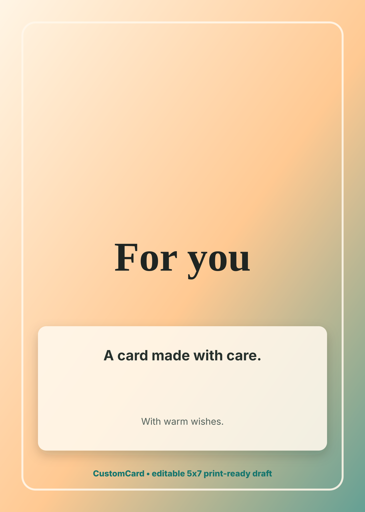

# Small Business Thank-You Benchmark

Run: `small-business-thank-you-2026-06-11T08-53-42-632Z`

## Competitor

- Competitor: Adobe Express
- Source: https://www.adobe.com/express/create/ai/card
- Touted prompt: `thanks for supporting our small business`

## CustomCard Output

- Text provider routed to: `cloudflare-workers-ai-chat` using model `@cf/meta/llama-3.2-3b-instruct`
- Image provider routed to: `cloudflare-workers-ai-image` using model `@cf/bytedance/stable-diffusion-xl-lightning`
- Live provider calls: text `true`, image `true`
- Persistence status: `stored`

Provider image artifact: [./customcard-provider-front-art.jpg](./customcard-provider-front-art.jpg)

## Prompt Shape

The CustomCard prompt is structured around our UI/UX instead of a single text box: occasion, recipient relationship, tone, style, approved memory notes, four editable panels, print-safe margins, and human review before external sharing.

See `effective-prompt.json` for the full prompt and `debug-log.json` for redacted provider/persistence logs.
