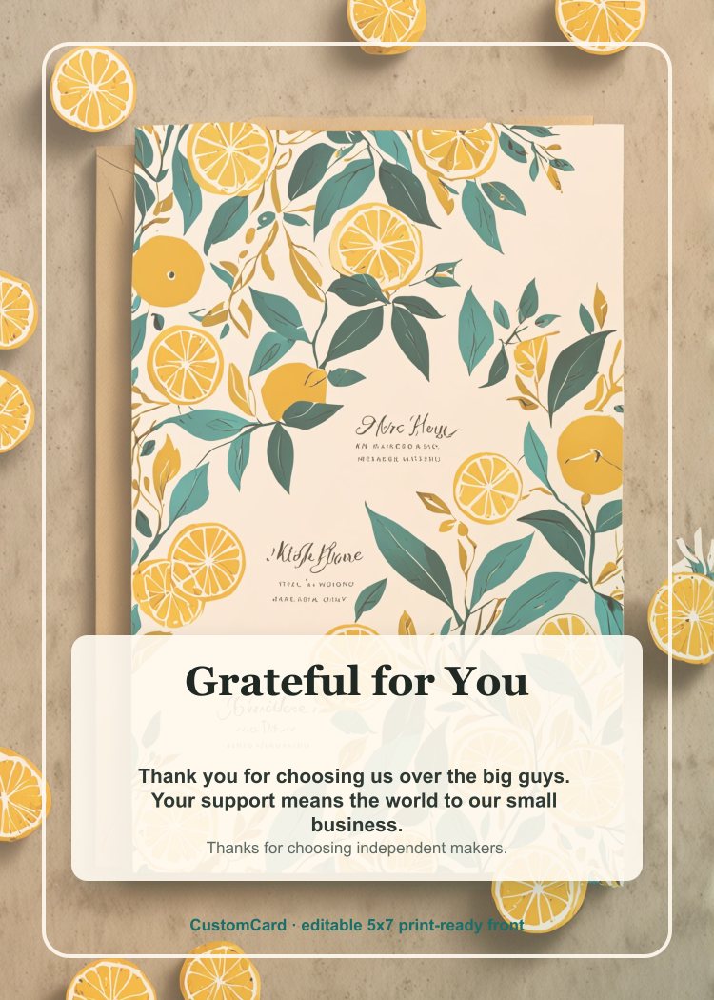

# Small Business Thank-You No-People Front Benchmark

Run: `small-business-thank-you-front-nopeople-2026-06-11T09-58-26-136Z`

## Competitor

- Competitor: Adobe Express
- Source: https://www.adobe.com/express/create/ai/card
- Touted prompt: `thanks for supporting our small business`

## CustomCard Output

- Text copy reused from JSON Mode run: `Grateful for You`
- Image provider routed to: `cloudflare-workers-ai-image` using model `@cf/bytedance/stable-diffusion-xl-lightning`
- Image scope for this run: `front panel only`
- Prompt treatment: `flat stationery, no people/faces/portraits`
- Persistence status: `stored`

SVG source: [./customcard-small-business-thanks-front.svg](./customcard-small-business-thanks-front.svg)
Provider image artifact: [./customcard-provider-front-art-nopeople.jpg](./customcard-provider-front-art-nopeople.jpg)

See `effective-prompt.json` for the full prompt and `debug-log.json` for redacted provider/persistence logs.
